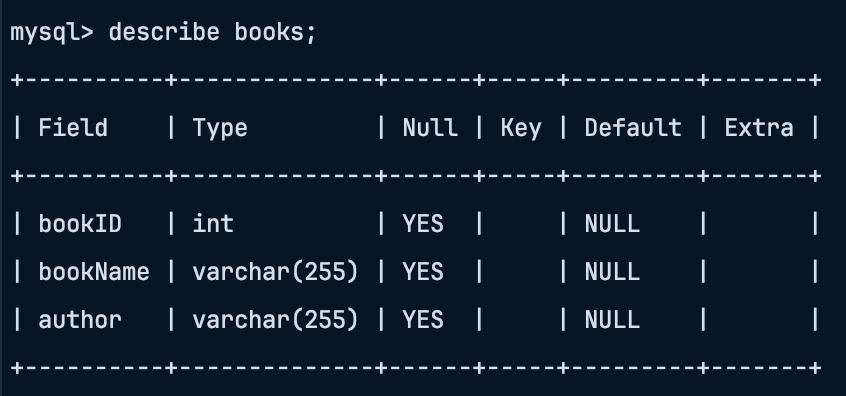

# Library Management API with JWT Authentication

## Overview

This is a Flask-based API for managing books in a database, secured with JSON Web Token (JWT) authentication. The API
supports operations such as retrieving, adding, updating, and deleting books. Authentication is required for all actions
via JWT, which is obtained by logging in as a user.

## Features

1. JWT Authentication.
2. CRUD operations for managing books (Create, Read, Update, Delete).
3. MySQL integration for storage of books.

## Setup

### Installation

1. Clone the repository.
2. Install required dependencies:

    ```bash
    pip install flask mysql-connector-python flask-jwt-extended
    ```

3. Create a MySQL Database:

    ```sql
    CREATE DATABASE library;
    ```
4. Create Table inside `library` Database
    ```sql
    CREATE TABLE book (
    bookID int,
    bookName varchar(255),
    author varchar(255)
    );
    ```

5. Configure MySQL credentials in the `mysql_connect.py` file.

### Database Schema:



### Running the Application

```bash
python app.py
```

## Endpoints

### Login (`POST` /login)

Authenticate the user and return a JWT token.

- Request Body:

   ```json
   {
     "username": "admin",
     "password": "admin"
   }
   ```

- Response:

   ```json
   {
     "access_token": "your_jwt_token"
   }
   ```

### Get All Books (`GET` /)

Get the list of all books. Requires a valid JWT token.

### Get a Book (`GET` /&lt;id&gt;)

Get a single book by ID. Requires a valid JWT token.

### Create a New Book (`POST` /new)

Create a new book. Requires a valid JWT token.

- Request Body:

   ```json
   {
     "bookID": 1,
     "bookName": "Book Title",
     "author": "Author Name"
   }
   ```

### Update a Book (`PATCH` /update/&lt;id&gt;)

Update the name of a book by ID. Requires a valid JWT token.

- Request Body:

   ```json
   {
     "bookName": "new BookName"
   }
   ```

### Delete a Book (`DELETE` /delete/&lt;id&gt;)

Delete a book by ID. Requires a valid JWT token.

## JWT Authentication

Use the `/login` endpoint to get a JWT token, then pass the token in the `Authorization` header in all endpoints.\
```Authorization: Bearer <your_jwt_token>```
